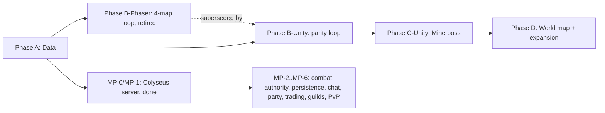

# HearthVale — Product Roadmap

Phased delivery plan for **HearthVale** (active Phaser Next browser client, shared TypeScript data layer, Node + Colyseus server now in progress alongside it). Starter scope: **Hearthlight Vale**, levels **1–14**.

**Related:** `STRATEGY.md` · `docs/world/HEARTHLIGHT_VALE_LAYOUT.md` · `docs/01_PROJECT_MEMORY.md`

---

## Overview

```
Phase A ──► Phaser archive ──► Unity experiment ──► Phaser Next ──► Expansion ──► Server
 data          historical         paused              current          planned       backlog
```

| Phase | Name | Status | Outcome |
|-------|------|--------|---------|
| **A** | Data foundation | **Done** | TS world catalog, portal graph, export/verify tooling |
| **B-Phaser** | Phaser starter 4-map loop | **Retired / superseded** | Reached 4-map loop + melee combat + job/skill catalogs before the client was retargeted to Unity; archived at `client-phaser-archive/` |
| **B-Unity** | Unity starter loop | **Paused reference** | Incomplete Unity scaffold retained at `client-unity/`; not the default launch path |
| **Phaser Next** | Lanternbound browser client | **Current / playable** | 33-map, two-region solo RPG through level 28 with saves, quests, combat, gathering, economy, mastery, runes, three-slot skill loadouts, and twelve callings |
| **C-Unity** | Dungeon depth + boss | Planned | Mine floors, Whisperwood unlock, first boss, skills wired into combat — Unity equivalent of the old Phase C goals |
| **D** | Early expansion + world map UI | Planned | Millwick, Moonwell chain, world map pins |
| **Later** | Server-authoritative multiplayer | **MP-0/MP-1 done, in progress** | Node + Colyseus server (`server/`) alongside the solo client: shared-world movement/visibility, local accounts, room-per-map. Combat authority, persistence, chat, party, trading, guilds, and PvP remain (MP-2..MP-6) |

**The data layer (`src/data/**`, `scripts/export-data.ts`, `scripts/verify-*.ts`, `tools/**`) remains the source of truth.** Phaser Next consumes the exported `data/*.json` and `data/catalog/*.json` directly.

---

## Phase A — Data foundation (done)

**Goal:** Single source of truth for the starter region before client or server work.

### Deliverables

- [x] Project bootstrap docs (`STRATEGY.md`, `AGENTS.md`, ledgers, handoff)
- [x] `src/data/world/types.ts` — `MapKind`, `MapDefinition`, `MapPortal`, `RegionDefinition`
- [x] `src/data/world/maps.ts` — all 10 Hearthlight Vale maps + portal graph
- [x] `src/data/world/regions.ts` — `hearthlight_vale` region + Hearth Courier warp table
- [x] `src/data/world/index.ts` — exports + `MAP_ALIASES`
- [x] `package.json` + `scripts/export-data.ts` → `data/maps.json`, `data/regions.json`
- [x] `scripts/verify-portals.ts` — target existence + bidirectional pairing
- [x] `docs/world/HEARTHLIGHT_VALE_LAYOUT.md` — layout reference
- [x] `docs/ROADMAP.md` — this document

### Exit criteria

- `npm run verify` passes with zero portal errors
- All 10 maps documented in layout reference match exported JSON
- No hand-edited duplicate map data outside `src/data/world/`

### Parallel workers (2026-06-11)

| Worker | Scope |
|--------|-------|
| Docs bootstrap | Ledgers, strategy, agents, handoff, README |
| World data | `src/data/world/*` |
| Build tooling | `package.json`, export/verify scripts |
| Layout + roadmap | This file + `HEARTHLIGHT_VALE_LAYOUT.md` |

---

## Phase B-Phaser — Phaser starter 4-map loop (retired / superseded)

**Goal (historical):** First playable client loop — prove the Path A stack end-to-end on Phaser 3.

This phase **shipped and then was retired** — not abandoned mid-flight. Before the Path A → Path B decision (2026-07-01), the Phaser client reached:

### Maps in scope

| Map | Role |
|-----|------|
| Hearthvale Town | Safe hub, Elder Gemhorn, Merchant Silas, Hearth Courier |
| Cloverfield Plains | Lv 1–4 grind (Jellybud, Spriggle) |
| Mushroom Hollow | Lv 3–6 grind (Puffshroom, Sporeling) |
| Old Crystal Mine | Lv 8–15 first dungeon (entry/exit only in B) |

### What it reached before retirement

- [x] Phaser 3 + TypeScript client scaffold
- [x] Map loader: base + props + collision JSON per map
- [x] Player movement, camera, portal transitions
- [x] NPC placeholder → live NPC dialogue system (title + paged dialogue, quest hints)
- [x] Basic mob spawns from `spawnTables` (client-side for solo)
- [x] Hearth Courier UI — free Cloverfield warp
- [x] Greybox art pass for four maps (see art checklist in layout doc)
- [x] Job class catalog (`src/data/catalog/jobs.ts`) — 1 base + 6 tier-1 paths, wired for selection
- [x] Skill catalog (`src/data/catalog/skills.ts`) — every job `startingSkills` id resolves to a real effect
- [x] Melee `CombatController` — aggro/leash, XP/levels, floating damage, target cycling
- [x] Click-to-move A* pathfinding, safe zones, HP/MP/SP/XP HUD, audio service, dev overlay (F3)

### Disposition

**Archived at `client-phaser-archive/`.** Kept for reference only — not run, not maintained, not a dependency of any current phase. All design intent it embodied (maps, jobs, skills, monsters, combat feel) carries forward into the data layer and into Phase B-Unity / Phase C-Unity below.

---

## Phaser Next — Lanternbound browser client (current)

**Goal:** Establish a clean, playable browser-first foundation without extending the retired client.

### Delivered

- [x] Fresh Phaser 3 + TypeScript + Vite project in `client-phaser-next/`
- [x] Direct consumption of shared map, NPC, and monster JSON data
- [x] Title/boot flow and responsive DOM HUD
- [x] Top-down movement, sprint, camera follow, and map bounds
- [x] NPC dialogue and data-driven portal travel
- [x] Monster spawning, chase behavior, melee combo, damage, respawn, XP, and leveling
- [x] Persistence/save slots and in-game system menu
- [x] Quest and inventory HUD backed by catalog items, quests, and drops
- [x] Responsive quest journal with current/available/completed views, lock guidance, objective and reward details, persistent pinning, and keyboard/touch access
- [x] Consumable use and equipment actions with saved equipment state
- [x] Complete consumable effects, persisted sprint stamina, poison/antidotes, timed buffs, return charm, and mobile pack access
- [x] First content expansion beyond the existing route: Moonreed Fen
- [x] Catalog-driven quest objectives, prerequisites, rewards, and quest-gated portals
- [x] Elemental combat strengths/resistances with readable battle feedback
- [x] Moonwell Heart capstone instance, boss encounter, and region-finale quest chain
- [x] Data-driven vendors and crafting with a gather → trade/craft → upgrade economy loop
- [x] Persisted discovery and quest-aware world map with route and gate states
- [x] Verified campaign graph connecting the default opening to all 33 maps
- [x] Full-party five-slot equipment, active ATK/DEF/HP/SPD/CRIT stats, and loot comparison armory
- [x] Vale Novice starts, six-path level-10 party advancement, retraining, and utility job mechanics
- [x] Twelve level-18 Lantern Masteries with save-compatible selection, paid retraining, active combat/economy bonuses, and responsive Trainer Bram UI
- [x] Emberglass Shelf and Hollow Kiln side arc with authored terrain, fire combat, boss, quests, loot, recipes, and warp
- [x] Lanternspire Summit joined finale with accepted-quest gate, final boss, Gloom counterplay, persisted epilogue, and completed-save title state
- [x] Persistent gathering nodes with cooldown saves, level/range gates, Ore Sense bonuses, minimap markers, quest guidance, and resource verification
- [x] Dawnshore Reach second-region foothold with Dawnshore Camp, Glasswind Coast, regional courier, quest, boss, materials, recipes, and upgrade rewards
- [x] Tidebreak Causeway and Stormglass Reliquary with telegraphed monster abilities, nine gathering nodes, linked quests, a boss, and level 16–18 rewards
- [x] Beaconfall Cliffs and Sunspire Observatory with Sunblind counterplay, a field merchant, nine gathering nodes, linked quests, Celestial Orrery boss, and level 18–20 rewards
- [x] Aurora Highlands and Zenith Archive with mutually exclusive oath quests, OR-gated shared finale, Fractured counterplay, nine gathering nodes, Keeper of Zenith boss, and level 20–22 rewards
- [x] Choirwood Canopy and Crownroot Sanctum with Muted counterplay, nine gathering nodes, linked quests, Crownroot Hierophant boss, level 22–24 rewards, and six quest-earned techniques
- [x] Persistent three-slot skill loadouts with level/quest/path gates, keyboard rebinding, responsive armory controls, auto-combat priorities, and save validation
- [x] Runeveil Gardens and Namesong Vault with nine gathering nodes, linked quests, Archivore boss, level 24–26 rewards, and reusable equipment runes
- [x] Waystar Moor and Convergence Spire with nine gathering nodes, linked quests, Manyroad Crown boss, level 26–28 rewards, and Severed rune counterplay
- [x] Twelve level-28 callings with free first choice, paid retraining, permanent bonuses, exclusive techniques, responsive Pathweaver UI, and save validation
- [x] Production build and browser smoke test

### Next

- [x] Continue beyond the reopened Zenith Archive with another connected route, new monster families, items, maps, quest consequences, and encounter mechanics
- [x] Continue beyond Namesong Vault with another reciprocal route, new monsters, items, maps, quests, and progression systems
- [ ] Reuse branching quest choices and ability/status counterplay across later campaign arcs
- [x] Progression depth beyond tier 1: later paths and additional quest-earned skill choices
- [ ] Continue beyond Convergence Spire with new maps, monsters, items, quests, calling consequences, and encounter systems
- [ ] Production art and audio pass

---

## Phase B-Unity — Unity starter loop (paused reference)

**Historical goal:** Reproduce Phase B-Phaser's core loop on Unity. This workstream is paused; the scaffold remains for reference and these unchecked items are not part of the active launch path.

### Maps in scope (same four as the original Phaser loop)

| Map | Role |
|-----|------|
| Hearthvale Town | Safe hub, Elder Gemhorn, Merchant Silas, Hearth Courier |
| Cloverfield Plains | Lv 1–4 grind (Jellybud, Spriggle) |
| Mushroom Hollow | Lv 3–6 grind (Puffshroom, Sporeling) |
| Old Crystal Mine | Lv 8–15 first dungeon (entry/exit only) |

### Deliverables

- [ ] `client-unity/` project scaffold (Unity 6 / 6000.x; pinned to 6000.5.1f1) — owned by the Unity workstream
- [ ] JSON parsing bridge that reads `data/maps.json` (and `data/regions.json`) at runtime — owned by the Unity workstream, consumed by this phase
- [ ] Town spawn — new character starts in Hearthvale Town
- [ ] WASD movement + camera follow
- [ ] 4-map portal loop using existing `data/maps.json`: town ↔ plains ↔ hollow ↔ mine (entry/exit only), no dead portals
- [ ] HP/EXP HUD (MP/SP can follow once combat lands in Phase C-Unity)
- [ ] NPC dialogue (title + paged dialogue, quest hints) reading from existing NPC data

### Exit criteria

- New character spawns in Hearthvale Town in the Unity client
- Full loop: town → plains → hollow → mine → return without dead portals, running on `data/maps.json` with no hand-edited duplicates
- HP/EXP HUD reflects data-layer values
- NPC dialogue renders from existing data

### Explicitly NOT in scope for Phase B-Unity (stretch / deferred to Phase C-Unity)

- Click-to-move A* pathfinding (existed in Phaser; not required for Unity parity)
- Full melee `CombatController` (aggro/leash, XP/levels, floating damage, target cycling)
- Job selection UI and skill-effect wiring
- Audio service, dev overlay

Do not claim these as done for Phase B-Unity — they are carried into Phase C-Unity below.

---

## Phase C-Unity — Dungeon depth + boss (planned)

**Goal:** Bring the Unity client to combat/content parity with what Phase C was scoped to deliver on Phaser, plus the depth work that phase targeted — vertical content in Old Crystal Mine, east-field expansion, and the job/skill catalogs wired into real combat.

### Maps added / deepened

| Map | Role |
|-----|------|
| Old Crystal Mine (floors) | Multi-floor layout, boss chamber |
| Whisperwood Meadows | Lv 5+ field (portal from Mushroom Hollow) |
| Crystal Mine Approach | Optional quarry approach lane |

### Deliverables

- [ ] Unity combat controller — aggro/leash, XP, floating damage, target cycling (parity with the retired Phaser `CombatController`)
- [ ] Click-to-move / pathfinding equivalent in Unity (stretch, carried from Phase B-Unity)
- [ ] Wire `SkillDefinition.effect` into the Unity combat controller so each job's `startingSkills` actually fire (damage skills via the existing `skillMultiplier` param; buffs/debuffs/heals as new bridge hooks)
- [ ] Job selection UI — let a level-10 character branch into one of the six tier-1 paths
- [ ] Mine floor 2+ layouts and portal-down wiring
- [ ] Boss encounter — **Gemhorn Sentinel** (original IP; not RO content)
- [ ] Whisperwood portal gate (`requiredLevel: 5`)
- [ ] Drop tables and quest hooks for mine completion
- [ ] Paid Hearth Courier warps (Hollow, Whisperwood)
- [ ] Audio stubs (`musicKey` per map) ported to Unity

### Exit criteria

- Party-of-one can clear mine boss and return to town with loot
- Whisperwood reachable from Hollow at level 5
- Phase B-Unity maps retain regression-free portal behavior

---

## Phase D — Early expansion + world map UI

**Goal:** Complete the Hearthlight Vale catalog on the Unity client; surface region on world map.

### Maps in scope

| Map | Role |
|-----|------|
| Old Mill Road | Lv 8–10 connector |
| Millwick Crossing | Second town hub |
| Moonwell Entrance | Lv 10–12 border field |
| Moonwell Ruins | Lv 11–14 capstone dungeon |

### Deliverables

- [x] Portal chain: Whisperwood → Old Mill Road → Millwick → Moonwell
- [x] Moonwell Ruins dungeon (simpler than mine boss; region finale)
- [x] World map UI with pins for all `showOnWorldMap: true` maps
- [x] Millwick economy NPCs (trader and crafting stations; warp hub remains separate)
- [x] Full Hearth Courier fee table and responsive travel UI (see layout doc)
- [x] Region completion quest arc and saved epilogue (Lv 14)
- [x] Connected Afterlight Expanse postgame hunt, boss, crafting, and rewards

### Exit criteria

- All 10 Phase A maps playable or reachable
- World map reflects `worldMapPosition` from data
- Starter region arc completable solo to level 14

---

## Later — Server-authoritative multiplayer (in progress)

**Goal:** Evolve `client-phaser-next` from a solo client into a true MMORPG —
a real Node + Colyseus server, alongside (not replacing) the solo campaign.

### MP-0 — Foundations (done, 2026-07-28)

- [x] `@hearthvale/sim` extracted from `client-phaser-next` into an npm-workspace
  package shared by the client and the new server (re-export shim keeps every
  existing import/smoke-test path unchanged)
- [x] `server/` package scaffolded: Colyseus + Express bootstrap on
  `ws://localhost:2567`, `server/src/data/loadGameData.ts` importing
  `src/data/**` directly (no JSON round-trip)
- [x] Local username/password accounts (SQLite + scrypt hashing, opaque
  session tokens) — `npm run dev:server`, `npm run build:server`,
  `npm run test:server`

### MP-1 — Shared-world movement & visibility (done, 2026-07-28)

- [x] `WorldRoom` — one Colyseus room per `mapId`, one `WorldSimulation`
  instance per connected player (their existing 4-unit squad, unmodified)
- [x] Server-side portal-gate validation (level/quest) on room-crossing,
  reconnect grace window
- [x] `MultiplayerWorldScene` + title-screen login panel in
  `client-phaser-next`; real players and their AI companions render and move
  live for every other connected player
- [x] Headless server smoke tests (`server/scripts/*-smoke.ts`): auth round
  trip, two-client shared-room movement visibility

Client-side prediction/reconciliation is not implemented yet — the client
renders server-authoritative state directly, fine for a same-machine/local
server but not yet built for real network latency.

### MP-2 — Server-authoritative combat + persistence (next)

- [ ] Move damage/XP/loot/monster-AI resolution to run only server-side;
  convert the remaining unseeded RNG (`rollDrops`, `gatherResource`'s bonus
  roll) to the existing seeded-RNG pattern
- [ ] SQLite character persistence (schema derived from `SaveGame`), replacing
  the ephemeral per-session character used by MP-0/MP-1
- [ ] Portal/warp validation already server-side (MP-1); extend to spawn
  tables once combat is authoritative

### MP-3 — Chat + real-player party grouping

- [ ] Always-on chat room (global/party/guild channels, survives portal-crossing room changes)
- [ ] Party/guild hooks: group 2-4 players (each keeping their AI companions)
  into a loot/XP-sharing "party of squads"

### MP-4 — Trading

- [ ] Server-mediated, dupe-proof two-player trade (staged offers, explicit lock-in, atomic swap)

### MP-5 — Guilds

- [ ] Roster, tag, chat, minimal persistence (no guild bank/quests)

### MP-6 — PvP

- [ ] Opt-in duels and/or PvP-flagged maps (not open-world, to preserve the cozy tone)

### Combat depth beyond the starter loop

- [x] Combat conditions with poison, Gloom, Drenched, cures, and visible penalties
- [x] Equipment slots and reusable one-rune-per-slot socket system with compatibility, active stats, assignment protection, and save validation
- [ ] Party/guild hooks (post-Colyseus)

### Content beyond Hearthlight Vale

- [x] Region 2 foundation: Dawnshore Reach, Dawnshore Camp, and Glasswind Coast
- [x] Dawnshore Reach expansion maps and level 16–18 quest arc
- [x] Dawnshore Reach level 18–28 route through Sunspire, Aurora, Zenith, Choirwood, Crownroot, Runeveil, Namesong, Waystar, and Convergence
- [ ] Instance maps (`kind: instance`)
- [ ] Seasonal events and cozy MMO social features

---

## Dependency graph



**Rule:** No phase skips portal verification. Each phase ends with `npm run verify` green — this applies regardless of which client engine consumes the data.

---

## Risks and mitigations

| Risk | Mitigation |
|------|------------|
| Portal graph drift between docs and data | `verify:portals` CI; layout doc references map IDs |
| Unity JSON bridge diverges from data-layer schema | Data layer stays the single source of truth; bridge owned by Unity workstream, validated against `data/maps.json` shape |
| Phase B-Unity silently over-claims combat/pathfinding parity | Roadmap explicitly marks those items as Phase C-Unity stretch goals, not Phase B-Unity done |
| Scope creep into multiplayer | Phased MP-0..MP-6 delivery; solo campaign stays untouched and playable throughout |
| RO IP contamination | Original names only; banked patterns are mechanics, not lore |

---

## Revision log

| Date | Change |
|------|--------|
| 2026-07-28 | Started real multiplayer (MP-0/MP-1 of the "Later" phase): extracted `@hearthvale/sim` into an npm-workspace package; scaffolded a Node + Colyseus `server/` (local-dev, `ws://localhost:2567`) with local SQLite accounts, one room per map, a `WorldSimulation` instance per connected player, server-side portal-gate validation, and reconnect handling; added `client-phaser-next`'s `MultiplayerWorldScene` and a title-screen login panel. Solo campaign unaffected; verified with new server smoke tests plus all pre-existing Phaser smoke suites and `npm run verify`. |
| 2026-07-22 | Extended Dawnshore Reach through Waystar Moor and Convergence Spire with six monsters, seventeen items, nine resources, six recipes, two quests, a tenth shop, seven abilities, Severed/Anchorcord counterplay, Manyroad Crown boss, two waylines, and twelve saved level-28 callings with exclusive techniques; all 24 Phaser smoke suites pass. |
| 2026-07-22 | Extended Dawnshore Reach through Runeveil Gardens and Namesong Vault with six monsters, eighteen items, nine resources, five recipes, two quests, a ninth shop, seven abilities, Archivore boss, two waylines, and five reusable equipment runes with saved socket loadouts; all 23 Phaser smoke suites pass. |
| 2026-07-22 | Extended Dawnshore Reach through Choirwood Canopy and Crownroot Sanctum with six monsters, seventeen items, nine resources, five recipes, two quests, an eighth shop, seven abilities, Muted/Clearvoice counterplay, Crownroot boss, two waylines, and six quest-earned techniques with three-slot skill loadouts; all 22 Phaser smoke suites pass. |
| 2026-07-22 | Extended Dawnshore Reach through Aurora Highlands and Zenith Archive with exclusive oath branches, an OR-gated finale, six monsters, seventeen items, nine resources, five recipes, three quests, a seventh shop, seven abilities, Fractured counterplay, Keeper of Zenith boss, and one wayline; all 21 Phaser smoke suites pass. |
| 2026-07-22 | Extended Dawnshore Reach through Beaconfall Cliffs and Sunspire Observatory with six monsters, sixteen items, nine resources, five recipes, two quests, a sixth shop, seven abilities, Sunblind counterplay, Celestial Orrery boss, and two waylines; all 20 Phaser smoke suites pass. |
| 2026-07-22 | Added twelve data-driven level-18 Lantern Masteries with free first selection, 300g retraining, save migration, path-change cleanup, active combat/economy effects, responsive Trainer Bram UI, and deterministic coverage. All 19 Phaser smoke suites pass. |
| 2026-07-22 | Added the responsive Lantern Path quest journal with current, available, locked, ready, and completed states; full objective/reward/NPC details; persistent quest pinning; keyboard/mobile access; pause behavior; save migration; and deterministic coverage. All 18 Phaser smoke suites pass. |
| 2026-07-22 | Extended Dawnshore Reach through Tidebreak Causeway and Stormglass Reliquary with five monsters, eleven items, nine resource nodes, four recipes, two quests, seven telegraphed abilities, Drenched counterplay, and two courier unlocks; all 17 Phaser smoke suites pass. |
| 2026-07-22 | Added persistent gathering and opened Dawnshore Reach as the second region with two maps, four monsters, nine items, four recipes, a fifth shop, and a complete Glasswind quest; all 16 Phaser smoke suites pass. |
| 2026-07-22 | Activated the eight-route Hearth Courier and added Afterlight Expanse with four monsters, six items, two recipes, a boss, and a complete postgame vigil; all 15 Phaser smoke suites pass. |
| 2026-07-22 | Connected the RO-authored default opening to the complete campaign, added a bidirectional 15-map reachability verifier, persisted discovery, and delivered the responsive quest-aware world map. |
| 2026-07-22 | Delivered Phaser Next's solo economy loop with 4 shops, 13 recipes, material-source coverage, deterministic buy/sell/craft rules, a responsive merchant workshop, and economy verification/smoke coverage. |
| 2026-06-11 | Initial roadmap — Phase A parallel bootstrap |
| 2026-07-01 | Refreshed against actual state: Phase A/B marked done, Phase C marked current; added skill catalog (`src/data/catalog/skills.ts`) connecting job `startingSkills` to real effects; moved combat/jobs out of the server-only "Later" backlog since client-side versions already exist or are in-flight |
| 2026-07-01 | Path A → Path B migration: renamed old Phase B to **Phase B-Phaser** and marked retired/superseded (archived at `client-phaser-archive/`); added **Phase B-Unity** as the current phase, scoped to parity with Phase B-Phaser's original goals only (town spawn, WASD movement + camera follow, 4-map portal loop, HP/EXP HUD, NPC dialogue) — pathfinding and full combat explicitly deferred to **Phase C-Unity**; renamed old Phase C to **Phase C-Unity** with the same goals (dungeon depth, Gemhorn Sentinel boss, skill-effect wiring) retargeted at the Unity client; data layer and Phase A/D/Later unaffected |
