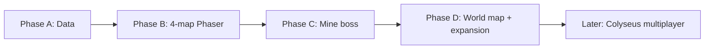

# HearthVale — Product Roadmap

Phased delivery plan for **HearthVale** (Path A: Phaser-first client, TypeScript data layer, Colyseus server later). Starter scope: **Hearthlight Vale**, levels **1–14**.

**Related:** `STRATEGY.md` · `docs/world/HEARTHLIGHT_VALE_LAYOUT.md` · `docs/01_PROJECT_MEMORY.md`

---

## Overview

```
Phase A ──► Phase B ──► Phase C ──► Phase D ──► Later (server)
 data         4-map       dungeon      expansion      Colyseus, multiplayer
 (done)       (done)      (current)    (planned)       (backlog)
```

| Phase | Name | Status | Outcome |
|-------|------|--------|---------|
| **A** | Data foundation | **Done** | TS world catalog, portal graph, export/verify tooling |
| **B** | Phaser starter 4-map loop | **Done** | Walkable town → plains → hollow → mine, HUD, NPC dialogue, job/skill catalogs |
| **C** | Dungeon depth + boss | **Current** | Mine floors, Whisperwood unlock, first boss, skills wired into combat |
| **D** | Early expansion + world map UI | Planned | Millwick, Moonwell chain, world map pins |
| **Later** | Server + jobs-in-multiplayer | Backlog | Colyseus, RO-inspired systems from code bank |

Note: a melee combat loop (`CombatController`, aggro/leash, XP/levels) has landed as an open PR against `main` but is not yet merged — treat "Combat hooks" below as in-flight, not shipped, until it lands.

---

## Phase A — Data foundation (done)

**Goal:** Single source of truth for the starter region before client or server work.

### Deliverables

- [x] Project bootstrap docs (`STRATEGY.md`, `AGENTS.md`, ledgers, handoff)
- [x] `src/data/world/types.ts` — `MapKind`, `MapDefinition`, `MapPortal`, `RegionDefinition`
- [x] `src/data/world/maps.ts` — all 10 Hearthlight Vale maps + portal graph
- [x] `src/data/world/regions.ts` — `hearthlight_vale` region + Hearth Courier warp table
- [x] `src/data/world/index.ts` — exports + `MAP_ALIASES`
- [x] `package.json` + `scripts/export-data.ts` → `data/maps.json`, `data/regions.json`
- [x] `scripts/verify-portals.ts` — target existence + bidirectional pairing
- [x] `docs/world/HEARTHLIGHT_VALE_LAYOUT.md` — layout reference
- [x] `docs/ROADMAP.md` — this document

### Exit criteria

- `npm run verify` passes with zero portal errors
- All 10 maps documented in layout reference match exported JSON
- No hand-edited duplicate map data outside `src/data/world/`

### Parallel workers (2026-06-11)

| Worker | Scope |
|--------|-------|
| Docs bootstrap | Ledgers, strategy, agents, handoff, README |
| World data | `src/data/world/*` |
| Build tooling | `package.json`, export/verify scripts |
| Layout + roadmap | This file + `HEARTHLIGHT_VALE_LAYOUT.md` |

---

## Phase B — Phaser starter 4-map loop (done)

**Goal:** First playable client loop — prove Path A stack end-to-end.

### Maps in scope

| Map | Role |
|-----|------|
| Hearthvale Town | Safe hub, Elder Gemhorn, Merchant Silas, Hearth Courier |
| Cloverfield Plains | Lv 1–4 grind (Jellybud, Spriggle) |
| Mushroom Hollow | Lv 3–6 grind (Puffshroom, Sporeling) |
| Old Crystal Mine | Lv 8–15 first dungeon (entry/exit only in B) |

### Deliverables

- [x] Phaser 3 + TypeScript client scaffold (`client/`)
- [x] Map loader: base + props + collision JSON per map
- [x] Player movement, camera, portal transitions
- [x] NPC placeholders → live NPC dialogue system (title + paged dialogue, quest hints)
- [x] Basic mob spawns from `spawnTables` (client-side for solo)
- [x] Hearth Courier UI — free Cloverfield warp
- [x] Greybox art pass for four maps (see art checklist in layout doc)
- [x] Job class catalog (`src/data/catalog/jobs.ts`) — 1 base + 6 tier-1 paths
- [x] Skill catalog (`src/data/catalog/skills.ts`) — every job `startingSkills` id resolves to a real effect

### Exit criteria

- New character spawns in Hearthvale Town
- Full loop: town → plains → hollow → mine → return without dead portals
- `export:data` JSON consumed by client without manual edits

---

## Phase C — Dungeon depth + boss (current)

**Goal:** Vertical content in Old Crystal Mine and east-field expansion; connect the new job/skill catalogs to real combat.

### Maps added / deepened

| Map | Role |
|-----|------|
| Old Crystal Mine (floors) | Multi-floor layout, boss chamber |
| Whisperwood Meadows | Lv 5+ field (portal from Mushroom Hollow) |
| Crystal Mine Approach | Optional quarry approach lane |

### Deliverables

- [ ] Merge the melee `CombatController` (open PR) — aggro/leash, XP, floating damage
- [ ] Wire `SkillDefinition.effect` into `CombatController` so each job's `startingSkills` actually fire (damage skills via the existing `skillMultiplier` param; buffs/debuffs/heals as new bridge hooks)
- [ ] Job selection UI — let a level-10 character branch into one of the six tier-1 paths
- [ ] Mine floor 2+ layouts and portal-down wiring
- [ ] Boss encounter — **Gemhorn Sentinel** (original IP; not RO content)
- [ ] Whisperwood portal gate (`requiredLevel: 5`)
- [ ] Drop tables and quest hooks for mine completion
- [ ] Paid Hearth Courier warps (Hollow, Whisperwood)
- [ ] Audio stubs (`musicKey` per map)

### Exit criteria

- Party-of-one can clear mine boss and return to town with loot
- Whisperwood reachable from Hollow at level 5
- Phase B maps retain regression-free portal behavior

---

## Phase D — Early expansion + world map UI

**Goal:** Complete the Hearthlight Vale catalog on client; surface region on world map.

### Maps in scope

| Map | Role |
|-----|------|
| Old Mill Road | Lv 8–10 connector |
| Millwick Crossing | Second town hub |
| Moonwell Entrance | Lv 10–12 border field |
| Moonwell Ruins | Lv 11–14 capstone dungeon |

### Deliverables

- [ ] Portal chain: Whisperwood → Old Mill Road → Millwick → Moonwell
- [ ] Moonwell Ruins dungeon (simpler than mine boss; region finale)
- [ ] World map UI with pins for all `showOnWorldMap: true` maps
- [ ] Millwick economy NPCs (crafting vendor, warp hub)
- [ ] Full Hearth Courier fee table (see layout doc)
- [ ] Region completion quest arc (Lv 14 send-off to next region — TBD)

### Exit criteria

- All 10 Phase A maps playable or reachable
- World map reflects `worldMapPosition` from data
- Starter region arc completable solo to level 14

---

## Later — Server-authoritative multiplayer (backlog)

**Goal:** Evolve from solo Phaser client to authoritative multiplayer MMO. Client-side combat and job/skill data landed earlier than originally planned (Phase B/C, not this backlog) — see Phase C above; this section is now server-only.

### Server (Colyseus)

- Node + Colyseus room per map (or shard)
- Move authoritative movement, combat, inventory server-side (reusing the client-proven formulas/skill catalog)
- Persistence layer (player state, quests, economy)
- Portal and warp validation server-side
- Replace client-side spawns with server spawn tables

### Combat depth beyond the starter loop

- [ ] Status effects (stun, poison, silence — original names)
- [ ] Equipment slots and card/socket system (if scoped)
- [ ] Party/guild hooks (post-Colyseus)

### Content beyond Hearthlight Vale

- [ ] Region 2+ (name TBD)
- [ ] Instance maps (`kind: instance`)
- [ ] Seasonal events and cozy MMO social features

---

## Dependency graph



**Rule:** No phase skips portal verification. Each phase ends with `npm run verify` green.

---

## Risks and mitigations

| Risk | Mitigation |
|------|------------|
| Portal graph drift between docs and data | `verify:portals` CI; layout doc references map IDs |
| Art bottleneck on Phase B | Greybox collision first; placeholder base tiles |
| Scope creep into multiplayer | Colyseus explicitly deferred to Later |
| RO IP contamination | Original names only; banked patterns are mechanics, not lore |

---

## Revision log

| Date | Change |
|------|--------|
| 2026-06-11 | Initial roadmap — Phase A parallel bootstrap |
| 2026-07-01 | Refreshed against actual state: Phase A/B marked done, Phase C marked current; added skill catalog (`src/data/catalog/skills.ts`) connecting job `startingSkills` to real effects; moved combat/jobs out of the server-only "Later" backlog since client-side versions already exist or are in-flight |
