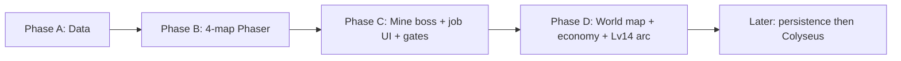

# HearthVale — Product Roadmap

Phased delivery plan for **HearthVale** (active Phaser Next browser client, shared TypeScript data layer, Node + Colyseus server now in progress alongside it). Starter scope: **Hearthlight Vale**, levels **1–14**.

**Related:** `STRATEGY.md` · `docs/world/HEARTHLIGHT_VALE_LAYOUT.md` · `docs/01_PROJECT_MEMORY.md`

---

## Overview

```
Phase A ──► Phase B ──► Phase C ──► Phase D ──► Later (server)
 data         4-map       dungeon      expansion      Colyseus, multiplayer
 (done)       (done)      (current)    (started)       (backlog)
```

| Phase | Name | Status | Outcome |
|-------|------|--------|---------|
| **A** | Data foundation | **Done** | TS world catalog, portal graph, export/verify tooling |
| **B** | Phaser starter 4-map loop | **Done** | Walkable town → plains → hollow → mine, HUD, NPC dialogue, job/skill catalogs |
| **C** | Dungeon depth + boss | **Current** | Combat loop shipped; mine floors, Gemhorn Sentinel, job UI, and *enforced* level gates still open |
| **D** | Early expansion + world map UI | **Started** | All 10 maps already walkable as greybox; remaining work is region UI, economy, and the Lv 14 quest arc |
| **Later** | Server + persistence | Backlog | Colyseus, save/load, vendor/gather skill kinds, production audio |

**How to read this file:** Phase boxes are *content goals*, not a strict shipping order. Several Phase D maps and the full combat loop landed while Phase C was still current. Checkboxes below are against the live client, not the original June plan.

---

## What is playable now (2026-08-20)

A new character can:

- Spawn in **Hearthvale Town**, talk to NPCs (**E**), and walk the **entire 10-map portal graph** (Whisperwood, Millwick, Moonwell included)
- Fight with auto-attack, **skills 1–4** (Vale Novice loadout), **Brace** (Shift), and 700ms enemy telegraphs
- Loot authored drops into a scene-owned bag that survives portal restarts
- Use the **Hearthglass HUD** (vitals, target, auras, minimap, **M** local map, recent loot)
- Run the same client on **iOS** (Capacitor landscape shell + touch overlay)

What they **cannot** do yet: pick a tier-1 job, be stopped by portal level gates, warp at the Hearth Courier, fight a scripted mine boss, or persist progress across a refresh.

---

## Phase A — Data foundation (done)

**Goal:** Single source of truth for the starter region before client or server work.

### Deliverables

- [x] Project bootstrap docs (`STRATEGY.md`, `AGENTS.md`, ledgers, handoff)
- [x] `src/data/world/types.ts` — `MapKind`, `MapDefinition`, `MapPortal`, `RegionDefinition`
- [x] `src/data/world/maps.ts` — all 10 Hearthlight Vale maps + portal graph
- [x] `src/data/world/regions.ts` — `hearthlight_vale` region + Hearth Courier warp table
- [x] `src/data/world/index.ts` — exports + `MAP_ALIASES`
- [x] `package.json` + `scripts/export-data.ts` → `data/maps.json`, `data/regions.json`
- [x] `scripts/verify-portals.ts` — target existence + bidirectional pairing
- [x] `docs/world/HEARTHLIGHT_VALE_LAYOUT.md` — layout reference
- [x] `docs/ROADMAP.md` — this document

### Exit criteria

- `npm run verify` passes with zero portal errors
- All 10 maps documented in layout reference match exported JSON
- No hand-edited duplicate map data outside `src/data/world/`

### Parallel workers (2026-06-11)

| Worker | Scope |
|--------|-------|
| Docs bootstrap | Ledgers, strategy, agents, handoff, README |
| World data | `src/data/world/*` |
| Build tooling | `package.json`, export/verify scripts |
| Layout + roadmap | This file + `HEARTHLIGHT_VALE_LAYOUT.md` |

---

## Phase B-Phaser — Phaser starter 4-map loop (retired / superseded)

**Goal (historical):** First playable client loop — prove the Path A stack end-to-end on Phaser 3.

This phase **shipped and then was retired** — not abandoned mid-flight. Before the Path A → Path B decision (2026-07-01), the Phaser client reached:

### Maps in scope

| Map | Role |
|-----|------|
| Hearthvale Town | Safe hub, Elder Gemhorn, Merchant Silas, Hearth Courier |
| Cloverfield Plains | Lv 1–4 grind (Jellybud, Spriggle) |
| Mushroom Hollow | Lv 3–6 grind (Puffshroom, Sporeling) |
| Old Crystal Mine | Lv 8–15 first dungeon (single-floor entry/exit in B) |

### What it reached before retirement

- [x] Phaser 3 + TypeScript client scaffold (`client/`)
- [x] Map loader: authored collision + props per map (`src/data/world/mapArt.ts`, `verify:map-art`)
- [x] Player movement, camera, portal transitions
- [x] NPC placeholder → live NPC dialogue system (title + paged dialogue, quest hints)
- [x] Basic mob spawns from `spawnTables` (client-side for solo)
- [x] Job class catalog (`src/data/catalog/jobs.ts`) — 1 base + 6 tier-1 paths
- [x] Skill catalog (`src/data/catalog/skills.ts`) — every job `startingSkills` id resolves to a real effect
- [x] Snapshot-driven HUD (later restyled as Hearthglass)

### Disposition

**Archived at `client-phaser-archive/`.** Kept for reference only — not run, not maintained, not a dependency of any current phase. All design intent it embodied (maps, jobs, skills, monsters, combat feel) carries forward into the data layer and into Phase B-Unity / Phase C-Unity below.

---

## Phaser Next — Lanternbound browser client (current)

**Goal:** Vertical content in Old Crystal Mine, east-field expansion, and connecting catalogs to *gated* play — not just data.

### Maps added / deepened

| Map | Role | Client status |
|-----|------|----------------|
| Old Crystal Mine | Multi-floor layout, boss chamber | **One map**, two spawn tables (`mine_upper_gallery`, `mine_deep_vein`). No floor-down portal. No boss entity. |
| Whisperwood Meadows | Lv 5+ field | **Walkable** with spawns/art. Hollow portal has `requiredLevel: 5` in data; `WorldScene.transitionToPortal` does **not** check it. |
| Crystal Mine Approach | Optional quarry lane | **Walkable** and wired to plains + mine. Approach → mine has `requiredLevel: 8` in data; also unenforced. |

### Deliverables — shipped during C

- [x] Merge melee `CombatController` — aggro/leash, XP, floating damage (this landed; it is not an open PR)
- [x] Wire `SkillDefinition.effect` into combat — hotbar **1–4** casts the active job's `startingSkills` (`damage` / `heal` / `buff` / `debuff` / `mark`). Player is hardcoded Vale Novice (`STARTING_JOB_ID = 'novice'` in `WorldScene`) until job selection ships. `economy` / `gather` / `utility` kinds stay for vendor/gather systems.
- [x] Reactive telegraphs — 700ms enemy wind-up, amber ring + `!`, **Brace** (Shift, 12 SP, 35% damage)
- [x] Live loot — authored `DROP_TABLES` roll on defeat; scene-owned inventory stacks across map restarts
- [x] Audio **stubs** — every map has `musicKey`; `AudioService` + `verify:audio` honor stub tracks (no production files yet, by design)
- [x] Whisperwood + Crystal Mine Approach as playable field maps (greybox + collision + spawns)

### Deliverables — still open

- [ ] **Job selection UI** — at level 10, branch into one of six tier-1 paths and swap the hotbar. Combat already loads skills from whatever job id is set; only the chooser + persistence are missing.
- [ ] **Enforce portal `requiredLevel`** — data exists on Hollow → Whisperwood (5), Approach → Mine (8), Moonwell Entrance → Ruins (11). Walking through currently ignores it.
- [ ] **Mine floor 2+** — split or portal-down from `old_crystal_mine`; `tools/scaffold-dungeon-floor.ts` exists but is unused in the catalog.
- [ ] **Boss encounter — Gemhorn Sentinel** (original IP; not RO content). Not in the monster catalog today.
- [ ] **Mine completion quest** — drop tables exist (`crystal_shard` etc.); there is no quest state machine or mine-clear hook. Stub quests (`quest_first_hunt`, `quest_millwick_letter`, `quest_moonwell_sigil`) are catalog-only.
- [ ] **Hearth Courier warp UI** — `REGIONS.warpTable` already has free Cloverfield + paid Hollow/Whisperwood/Millwick/Approach/Moonwell. The NPC talks; there is no destination picker and no currency spend.

### Exit criteria

- Party-of-one can clear the mine **boss** and return to town with loot
- Whisperwood is reachable from Hollow **only at level 5+** (client-enforced)
- Phase B maps retain regression-free portal behavior
- A level-10 character can leave Vale Novice for a tier-1 job

### Next slice

Remaining Phase C is several independent systems. Name **one** as the next build target before starting code (job UI, level gates, mine floors/boss, or courier warps). See the session note in `docs/14_SESSION_HANDOFF.md`.

---

## Phase D — Early expansion + world map UI (started)

**Goal:** Finish the Hearthlight Vale *experience* on the client — region map, economy, Lv 14 send-off. Map geometry shipped early.

### Maps in scope

| Map | Role | Client status |
|-----|------|----------------|
| Old Mill Road | Lv 8–10 connector | Walkable; spawns Roadjack / Windmite / Barkling |
| Millwick Crossing | Second town hub | Walkable safe zone; Mayor Holt, Merchant Elsie, Hearth Courier (dialogue only) |
| Moonwell Entrance | Lv 10–12 border field | Walkable; ruins portal authored at `requiredLevel: 11` (unenforced) |
| Moonwell Ruins | Lv 11–14 capstone | Walkable dungeon with `moonwell_guardian` in the inner sanctum — **not** a scripted finale |

### Deliverables

- [x] Portal chain walkable: Whisperwood → Old Mill Road → Millwick / Moonwell
- [x] Authored collision + themed props on **all 10** maps (`verify:map-art`)
- [x] Local map HUD (**M**) with player position, portal/NPC POIs — this is **not** the region world map
- [ ] In-game **world map UI** with pins for every `showOnWorldMap: true` map (`worldMapPosition` is already on each `MapDefinition`; `tools/world-map-preview.html` is editor-only)
- [ ] Millwick economy (buy/sell against the item catalog; Wayfarer `haggle` has nowhere to land yet)
- [ ] Hearth Courier fee table **in play** (data is in `regions.ts`; UI is Phase C leftover)
- [ ] Region completion quest arc (Lv 14 send-off to the next region — TBD)
- [ ] Scripted Moonwell finale (today `moonwell_guardian` is a weighted spawn, not a boss encounter)

### Exit criteria

- All 10 Phase A maps playable **and** gated/quested to match `levelRange`
- World map reflects `worldMapPosition` from data
- Starter region arc completable solo to level 14 with a job path and persistent loot

---

## Platform track — iOS (shipped v1, ongoing)

Not a Path A phase box; it runs beside C/D.

- [x] Capacitor 8 + Xcode landscape shell (`client/ios`, `npm run ios:sync` / `ios:open`)
- [x] Offline production bundle (embedded JSON/CSS, classic script — no local `fetch` of modules)
- [x] Multi-touch overlay: move, skills 1–4, Talk, Attack, Brace, Map
- [ ] Device persistence, Game Center / accounts, and production audio (stay Later unless scoped)

---

## Later — Server-authoritative multiplayer (in progress)

**Goal:** Evolve from solo Phaser client to authoritative multiplayer MMO. Client-side combat, jobs/skills, loot, and the 10-map greybox landed in B/C/D — this section is server, persistence, and post-region content.

### Pre-server client gaps (do not wait for Colyseus)

- [ ] Save/load player state (job, level/XP, inventory, map/position)
- [ ] Currency + vendor buy/sell (needed before paid warps feel real)
- [ ] Quest log that can complete, not only hint in dialogue
- [ ] Production music/SFX files behind existing stub keys

### MP-0 — Foundations (done, 2026-07-28)

- [x] `@hearthvale/sim` extracted from `client-phaser-next` into an npm-workspace
  package shared by the client and the new server (re-export shim keeps every
  existing import/smoke-test path unchanged)
- [x] `server/` package scaffolded: Colyseus + Express bootstrap on
  `ws://localhost:2567`, `server/src/data/loadGameData.ts` importing
  `src/data/**` directly (no JSON round-trip)
- [x] Local username/password accounts (SQLite + scrypt hashing, opaque
  session tokens) — `npm run dev:server`, `npm run build:server`,
  `npm run test:server`

### MP-1 — Shared-world movement & visibility (done, 2026-07-28)

- [x] `WorldRoom` — one Colyseus room per `mapId`, one `WorldSimulation`
  instance per connected player (their existing 4-unit squad, unmodified)
- [x] Server-side portal-gate validation (level/quest) on room-crossing,
  reconnect grace window
- [x] `MultiplayerWorldScene` + title-screen login panel in
  `client-phaser-next`; real players and their AI companions render and move
  live for every other connected player
- [x] Headless server smoke tests (`server/scripts/*-smoke.ts`): auth round
  trip, two-client shared-room movement visibility

Client-side prediction/reconciliation is not implemented yet — the client
renders server-authoritative state directly, fine for a same-machine/local
server but not yet built for real network latency.

### MP-2 — Server-authoritative combat + persistence (next)

- [ ] Move damage/XP/loot/monster-AI resolution to run only server-side;
  convert the remaining unseeded RNG (`rollDrops`, `gatherResource`'s bonus
  roll) to the existing seeded-RNG pattern
- [ ] SQLite character persistence (schema derived from `SaveGame`), replacing
  the ephemeral per-session character used by MP-0/MP-1
- [ ] Portal/warp validation already server-side (MP-1); extend to spawn
  tables once combat is authoritative

### MP-3 — Chat + real-player party grouping

- [ ] Always-on chat room (global/party/guild channels, survives portal-crossing room changes)
- [ ] Party/guild hooks: group 2-4 players (each keeping their AI companions)
  into a loot/XP-sharing "party of squads"

### MP-4 — Trading

- [ ] Server-mediated, dupe-proof two-player trade (staged offers, explicit lock-in, atomic swap)

### MP-5 — Guilds

- [ ] Roster, tag, chat, minimal persistence (no guild bank/quests)

### MP-6 — PvP

- [ ] Opt-in duels and/or PvP-flagged maps (not open-world, to preserve the cozy tone)

### Combat depth beyond the starter loop

- [x] Combat conditions with poison, Gloom, Drenched, cures, and visible penalties
- [x] Equipment slots and reusable one-rune-per-slot socket system with compatibility, active stats, assignment protection, and save validation
- [ ] Party/guild hooks (post-Colyseus)

### Content beyond Hearthlight Vale

- [x] Region 2 foundation: Dawnshore Reach, Dawnshore Camp, and Glasswind Coast
- [x] Dawnshore Reach expansion maps and level 16–18 quest arc
- [x] Dawnshore Reach level 18–28 route through Sunspire, Aurora, Zenith, Choirwood, Crownroot, Runeveil, Namesong, Waystar, and Convergence
- [ ] Instance maps (`kind: instance`)
- [ ] Seasonal events and cozy MMO social features

---

## Dependency graph



Maps for C and D already exist in the client. Remaining edges are **systems** (gates, boss, jobs, UI, quests), not new map files.

**Rule:** No phase skips portal verification. Each phase ends with `npm run verify` green.

---

## Risks and mitigations

| Risk | Mitigation |
|------|------------|
| Portal graph drift between docs and data | `verify:portals` CI; layout doc references map IDs |
| Roadmap drift vs opportunistic shipping | Refresh this file against `docs/14_SESSION_HANDOFF.md` when a loop closes (combat, loot, iOS, all-10-map art) |
| Art bottleneck | Authored `mapArt.ts` + collision JSON first; production tileset still Later |
| Scope creep into multiplayer | Colyseus explicitly deferred to Later |
| RO IP contamination | Original names only; banked patterns are mechanics, not lore |
| Unenforced `requiredLevel` | Treat as a Phase C bug, not a Phase D feature — data is already lying to the layout doc |

---

## Revision log

| Date | Change |
|------|--------|
| 2026-07-28 | Started real multiplayer (MP-0/MP-1 of the "Later" phase): extracted `@hearthvale/sim` into an npm-workspace package; scaffolded a Node + Colyseus `server/` (local-dev, `ws://localhost:2567`) with local SQLite accounts, one room per map, a `WorldSimulation` instance per connected player, server-side portal-gate validation, and reconnect handling; added `client-phaser-next`'s `MultiplayerWorldScene` and a title-screen login panel. Solo campaign unaffected; verified with new server smoke tests plus all pre-existing Phaser smoke suites and `npm run verify`. |
| 2026-07-22 | Extended Dawnshore Reach through Waystar Moor and Convergence Spire with six monsters, seventeen items, nine resources, six recipes, two quests, a tenth shop, seven abilities, Severed/Anchorcord counterplay, Manyroad Crown boss, two waylines, and twelve saved level-28 callings with exclusive techniques; all 24 Phaser smoke suites pass. |
| 2026-07-22 | Extended Dawnshore Reach through Runeveil Gardens and Namesong Vault with six monsters, eighteen items, nine resources, five recipes, two quests, a ninth shop, seven abilities, Archivore boss, two waylines, and five reusable equipment runes with saved socket loadouts; all 23 Phaser smoke suites pass. |
| 2026-07-22 | Extended Dawnshore Reach through Choirwood Canopy and Crownroot Sanctum with six monsters, seventeen items, nine resources, five recipes, two quests, an eighth shop, seven abilities, Muted/Clearvoice counterplay, Crownroot boss, two waylines, and six quest-earned techniques with three-slot skill loadouts; all 22 Phaser smoke suites pass. |
| 2026-07-22 | Extended Dawnshore Reach through Aurora Highlands and Zenith Archive with exclusive oath branches, an OR-gated finale, six monsters, seventeen items, nine resources, five recipes, three quests, a seventh shop, seven abilities, Fractured counterplay, Keeper of Zenith boss, and one wayline; all 21 Phaser smoke suites pass. |
| 2026-07-22 | Extended Dawnshore Reach through Beaconfall Cliffs and Sunspire Observatory with six monsters, sixteen items, nine resources, five recipes, two quests, a sixth shop, seven abilities, Sunblind counterplay, Celestial Orrery boss, and two waylines; all 20 Phaser smoke suites pass. |
| 2026-07-22 | Added twelve data-driven level-18 Lantern Masteries with free first selection, 300g retraining, save migration, path-change cleanup, active combat/economy effects, responsive Trainer Bram UI, and deterministic coverage. All 19 Phaser smoke suites pass. |
| 2026-07-22 | Added the responsive Lantern Path quest journal with current, available, locked, ready, and completed states; full objective/reward/NPC details; persistent quest pinning; keyboard/mobile access; pause behavior; save migration; and deterministic coverage. All 18 Phaser smoke suites pass. |
| 2026-07-22 | Extended Dawnshore Reach through Tidebreak Causeway and Stormglass Reliquary with five monsters, eleven items, nine resource nodes, four recipes, two quests, seven telegraphed abilities, Drenched counterplay, and two courier unlocks; all 17 Phaser smoke suites pass. |
| 2026-07-22 | Added persistent gathering and opened Dawnshore Reach as the second region with two maps, four monsters, nine items, four recipes, a fifth shop, and a complete Glasswind quest; all 16 Phaser smoke suites pass. |
| 2026-07-22 | Activated the eight-route Hearth Courier and added Afterlight Expanse with four monsters, six items, two recipes, a boss, and a complete postgame vigil; all 15 Phaser smoke suites pass. |
| 2026-07-22 | Connected the RO-authored default opening to the complete campaign, added a bidirectional 15-map reachability verifier, persisted discovery, and delivered the responsive quest-aware world map. |
| 2026-07-22 | Delivered Phaser Next's solo economy loop with 4 shops, 13 recipes, material-source coverage, deterministic buy/sell/craft rules, a responsive merchant workshop, and economy verification/smoke coverage. |
| 2026-06-11 | Initial roadmap — Phase A parallel bootstrap |
| 2026-07-01 | Refreshed against actual state: Phase A/B marked done, Phase C marked current; added skill catalog (`src/data/catalog/skills.ts`) connecting job `startingSkills` to real effects; moved combat/jobs out of the server-only "Later" backlog since client-side versions already exist or are in-flight |
| 2026-08-20 | Corrected drift through July–August: combat PR note removed (loop + skills + telegraphs + loot are on `main`); Whisperwood/Approach/Millwick/Moonwell marked walkable greybox; audio stubs, iOS v1, and all-10-map art recorded; Phase C remaining narrowed to job UI, enforced level gates, mine floors/boss, courier warp UI, mine quest; Phase D marked started |
